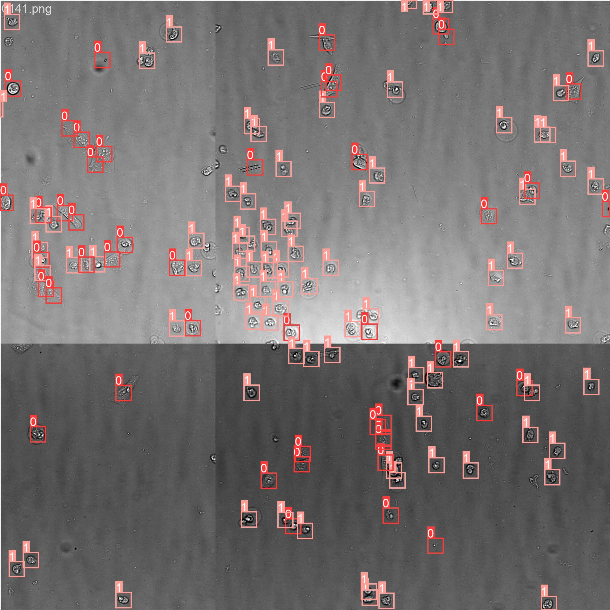
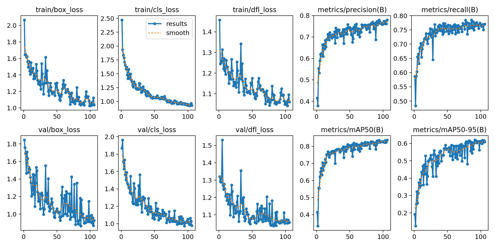
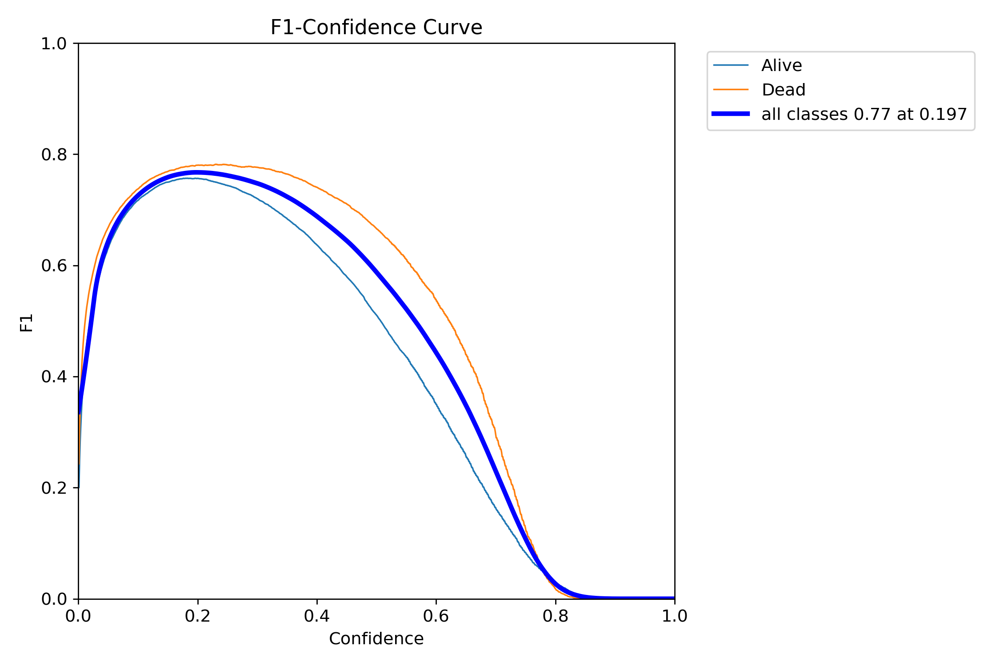
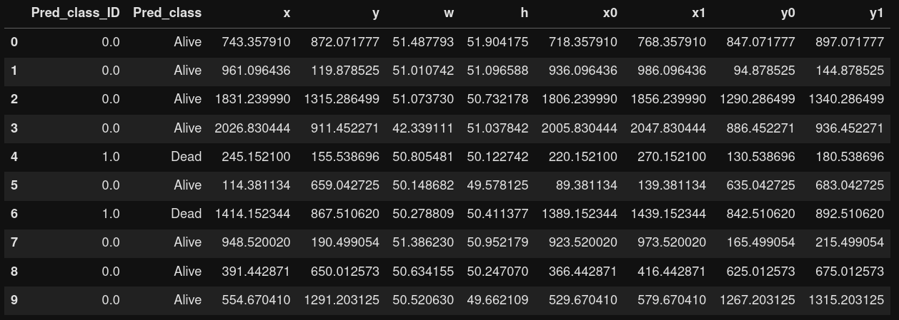
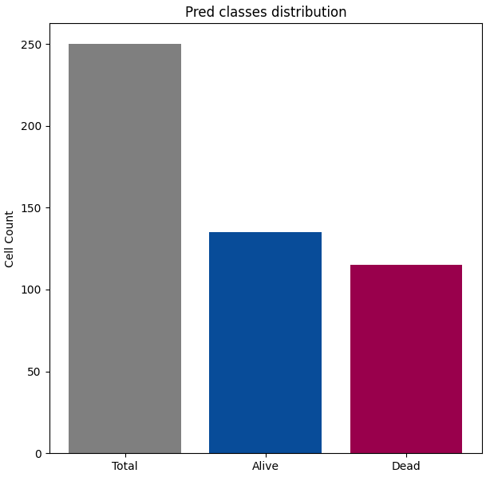

# YOLO Detection model for Cell Viability


## Introduction
Detection models are able both to find objects coordinates on images and classify them. Unlike classification models, detection models are able to predict several objects with different classes on the same image, making it a powerful tool for cellular images and especially for cell viability analysis.

## Dataset
### Images
The Dataset is composed of 480 images (X10) of U2OS cell line treated with different confidential compounds. These are high resolution grayscale images (2048,2048,1).
All images were acquired in three channels :
  - Transmitted light : the model  input
  - FITC : a DIOC staining used for cell localization (x/y coordinates calculation) for the labeling
  - DAPI : a DAPI staining used for cell classification (Alive/Dead) for the labeling

Input images were normalized by quantiles (0.0005,0.9995) and saved in png format. The dataset were divided in training and validation parts (0.8/0.2).

### Labels
Each image has a text file as label with one row by cell.

Each row contains 5 values :
  1. the class ID
  2. the normalized x coordinate of the center of the box
  3. the normalized y coordinate of the center of the box
  4. the normalized width of the box
  5. the normalized height of the box


### Dataset Download Link
https://www.kaggle.com/datasets/felixp09/cell-viability-detection/data


### Image sample from the training set for supervised learning


## Model training
We trained a YOLOv8n detection model, developed by Ultralytics package (https://docs.ultralytics.com/). The model is trained from a pre-trained model, to which two new classes will be added (Alive Cell and Dead Cell).
YOLO training needs a yaml file containing the dataset pathway and the new classes IDs.
Model training is performed with a maximum of 300 epochs and two losses calculation for localization (box_loss) and classification (cls_loss).
At the end of the training, plots are automatically generated :
  - the confusion matrix
  - the F1-score in function of confidence value (the probability that a box contains an object)
  - the different losses / metrics along epochs

## Training results
### Losses / metrics

### F1-score / Confidence value


## Use the model

```jupyter
# Packages
from ultralytics import YOLO
# Custom functions
from Functions.Functions import AutoNormalize, Img_processing, Custom_results

# Model Loading
model = YOLO("model/Cell_viability_detector.pt")

# Get the pathway of input image
INPUT_PATH = "datasets/images/val/0000.png"

# Set hyper-parameters
CONF = 0.197
MAX_DET = 3000
IMGSZ = 2048

# Image processing
INPUT_IMG = Img_processing(INPUT_PATH)

# Model prediction
PRED = model.predict(INPUT_IMG, conf = CONF, max_det = MAX_DET, imgsz = IMGSZ)

# Results
RES = Custom_results(PRED[0])
```
## Get Results

```ruby
# Prediction plot
RES.Img_plot
```


```ruby
# Get Cell data
RES.Cell_Data
```



```ruby
# Viability plot
RES.Viability_plot()
```


